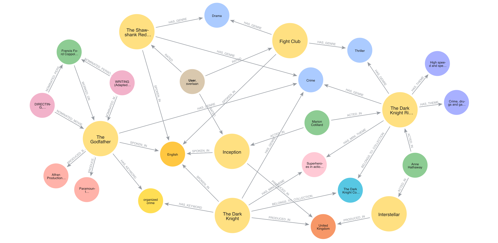

<p align="center">
  
</p>


# MovieGraph

[](https://github.com/Sverlaan/MovieGraph/actions/workflows/run_etl.yml)


MovieGraph is a movie knowledge graph and GraphRAG system built on top of Neo4j. It scrapes movie data from Letterboxd, TMDB, and Oscar records, models it as a graph, and exposes a natural language interface powered by an LLM that translates questions into Cypher queries.

The system consists of two main components:

- **ETL pipeline** — scrapes and transforms data from multiple sources, then loads it into a Neo4j graph database. Runs daily via GitHub Actions.
- **GraphRAG API** — a FastAPI app that takes natural language questions, generates Cypher using LLM calls, queries the graph, and returns answers with a graph visualization.

## Setup

Create and activate a virtual environment, then install the package and all dependencies from [pyproject.toml](pyproject.toml):

```bash
python3.13 -m venv .venv
source .venv/bin/activate
pip install -e . --config-settings editable_mode=compat
```

Create a `credentials.env` file in the project root with the following keys:

```
OPENAI_API_KEY=...
TMDB_API_KEY=...
NEO4J_URI=...
NEO4J_USERNAME=...
NEO4J_PASSWORD=...
NEO4J_DATABASE=...
```

The active Neo4j environment (`AURA` or `LOCAL`) and other settings are configured in [config.yaml](config.yaml).

## ETL

The ETL pipeline scrapes data from Letterboxd, TMDB, and Oscar nomination records, then builds a Neo4j knowledge graph from the collected sources. The graph schema is defined in the ontology — see the [ontology docs](etl/ontology/docs/ontology.md) for the full node and relationship reference.

Run the full pipeline:
```bash
run-etl
```

Or run each step individually:
```bash
update-sources   # scrape and update data sources
build-graph      # build the Neo4j graph from updated sources
```

The pipeline runs automatically every day at 01:00 UTC via the [GitHub Actions workflow](.github/workflows/run_etl.yml).

## GraphRAG

The GraphRAG API lets you ask natural language questions about the movie graph. Questions are translated into Cypher (Text2Cypher) by GPT, executed against Neo4j, and returned as a text answer alongside an interactive graph visualization.

The web UI at `http://localhost:8000` provides a chat-style interface where you can type questions, see the generated Cypher, browse the answer, and explore the resulting graph visually.

Start the API:
```bash
run-api
```
