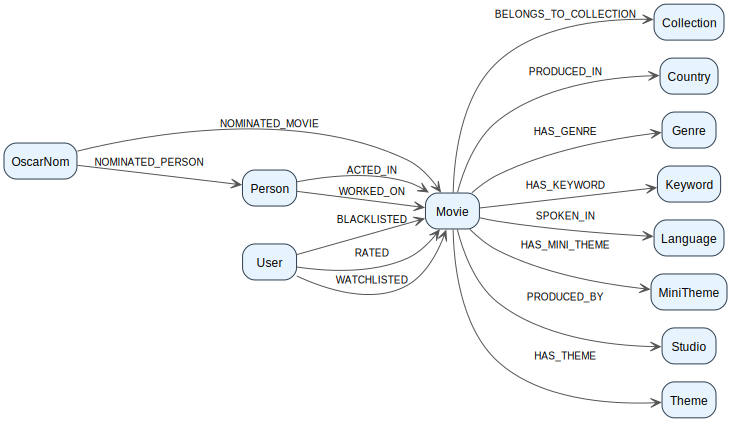
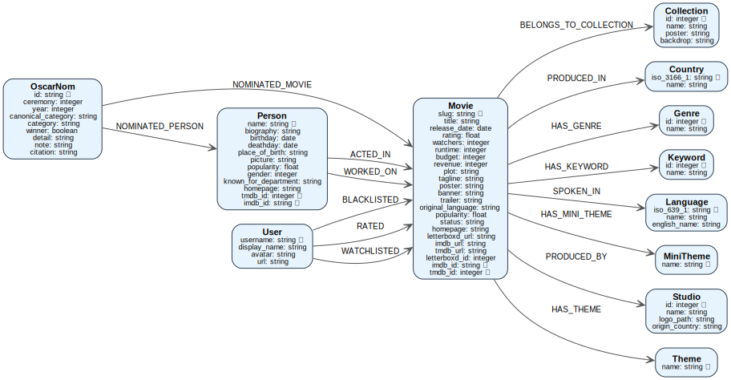

# MovieGraph Ontology

## 📊 Ontology Summary

| Metric | Value |
|--------|-------|
| Node Types | 12 |
| Relationship Types | 15 |
| Total Node Properties | 67 |
| Total Relationship Properties | 6 |
| Generated At | 2026-03-08T12:13:16.471927 UTC |

## Schema

## Schema (Detailed)

## Nodes

### Collection

**Description:** Represents a movie collection (series or franchise).

**Primary Keys:** `id`

| Property | Type | Description |
|----------|------|-------------|
| **`id`** 🔑 | `integer` | Collection identifier. |
| `name` | `string` | Name of the collection. |
| `poster` | `string` | Poster image URL. |
| `backdrop` | `string` | Backdrop image URL. |

### Country

**Description:** Represents a country.

**Primary Keys:** `iso_3166_1`

| Property | Type | Description |
|----------|------|-------------|
| **`iso_3166_1`** 🔑 | `string` | ISO 3166-1 alpha-2 country code. |
| `name` | `string` | Official country name. |

### Genre

**Description:** Represents a genre category for movies.

**Primary Keys:** `id`

| Property | Type | Description |
|----------|------|-------------|
| **`id`** 🔑 | `integer` | Unique genre identifier. |
| `name` | `string` | Name of the genre. |

### Keyword

**Description:** Represents a keyword/tag associated with a movie.

**Primary Keys:** `id`

| Property | Type | Description |
|----------|------|-------------|
| **`id`** 🔑 | `integer` | Keyword identifier. |
| `name` | `string` | Keyword text. |

### Language

**Description:** Represents a language spoken in movies.

**Primary Keys:** `iso_639_1`

| Property | Type | Description |
|----------|------|-------------|
| **`iso_639_1`** 🔑 | `string` | ISO 639-1 language code. |
| `name` | `string` | Native name of the language. |
| `english_name` | `string` | English name of the language. |

### MiniTheme

**Description:** Finer-grained theme associated with a movie.

**Primary Keys:** `name`

| Property | Type | Description |
|----------|------|-------------|
| **`name`** 🔑 | `string` | Name of the mini-theme. |

### Movie

**Description:** Represents a movie with its metadata, ratings, media links, and performance metrics.

**Primary Keys:** `slug`, `imdb_id`, `tmdb_id`

| Property | Type | Description |
|----------|------|-------------|
| **`slug`** 🔑 | `string` | Unique identifier for the movie in the local database. |
| `title` | `string` | The official title of the movie. |
| `release_date` | `date` | The release date of the movie. |
| `rating` | `float` | Average user rating of the movie. |
| `watchers` | `integer` | Number of users watching or tracking the movie. |
| `runtime` | `integer` | Duration of the movie in minutes. |
| `budget` | `integer` | Production budget in USD. |
| `revenue` | `integer` | Revenue generated by the movie in USD. |
| `plot` | `string` | Plot summary of the movie. |
| `tagline` | `string` | Short tagline associated with the movie. |
| `poster` | `string` | URL to the poster image. |
| `banner` | `string` | URL to the banner or backdrop image. |
| `trailer` | `string` | URL to the official trailer. |
| `original_language` | `string` | Original spoken language code of the movie. |
| `popularity` | `float` | Popularity score from the external source. |
| `status` | `string` | Current status of the movie (Released, Post Production, etc.). |
| `homepage` | `string` | Official homepage URL for the movie. |
| `letterboxd_url` | `string` | URL to the movie on Letterboxd. |
| `imdb_url` | `string` | URL to the movie on IMDb. |
| `tmdb_url` | `string` | URL to the movie on TMDb. |
| `letterboxd_id` | `integer` | Unique Letterboxd ID. |
| **`imdb_id`** 🔑 | `string` | IMDb identifier. |
| **`tmdb_id`** 🔑 | `integer` | TMDb identifier. |

### OscarNom

**Description:** Represents an Oscar nomination for a movie or person.

**Primary Keys:** `id`

| Property | Type | Description |
|----------|------|-------------|
| **`id`** 🔑 | `string` | Unique nomination ID. |
| `ceremony` | `integer` | Number of the ceremony. |
| `year` | `integer` | Year of the ceremony. |
| `canonical_category` | `string` | Standardized category name. |
| `category` | `string` | Original category name. |
| `winner` | `boolean` | True if the nomination won. |
| `detail` | `string` | Additional details about the nomination. |
| `note` | `string` | Any relevant notes. |
| `citation` | `string` | Reference for verification. |

### Person

**Description:** Represents a person involved in movies, such as actors, directors, or crew.

**Primary Keys:** `name`, `tmdb_id`, `imdb_id`

| Property | Type | Description |
|----------|------|-------------|
| **`name`** 🔑 | `string` | Full name of the person. |
| `biography` | `string` | Brief biography of the person. |
| `birthday` | `date` | Birth date of the person. |
| `deathday` | `date` | Death date if applicable. |
| `place_of_birth` | `string` | City/country of birth. |
| `picture` | `string` | URL to a picture of the person. |
| `popularity` | `float` | Popularity score from external sources. |
| `gender` | `integer` | Gender code (1=female, 2=male, 0/unknown). |
| `known_for_department` | `string` | Main professional department (Acting, Directing, etc.). |
| `homepage` | `string` | Official homepage URL. |
| **`tmdb_id`** 🔑 | `integer` | TMDb identifier. |
| **`imdb_id`** 🔑 | `string` | IMDb identifier. |

### Studio

**Description:** Represents a production studio.

**Primary Keys:** `id`

| Property | Type | Description |
|----------|------|-------------|
| **`id`** 🔑 | `integer` | Studio identifier. |
| `name` | `string` | Studio name. |
| `logo_path` | `string` | URL to the studio logo. |
| `origin_country` | `string` | Country of origin. |

### Theme

**Description:** High-level theme associated with a movie.

**Primary Keys:** `name`

| Property | Type | Description |
|----------|------|-------------|
| **`name`** 🔑 | `string` | Name of the theme. |

### User

**Description:** Represents a user of the platform.

**Primary Keys:** `username`

| Property | Type | Description |
|----------|------|-------------|
| **`username`** 🔑 | `string` | Unique username of the user. |
| `display_name` | `string` | Display name of the user. |
| `avatar` | `string` | URL to the user's avatar. |
| `url` | `string` | URL to the user's profile. |

## Relationships

### ACTED_IN

**Description:** Indicates that a person acted in a movie.

- **Source:** `Person` (*tmdb_id*)
- **Target:** `Movie` (*slug*)

| Property | Type | Description |
|----------|------|-------------|
| `character` | `string` | Name of the character played. |
| `billing_order` | `integer` | Order of billing in the credits. |

### BELONGS_TO_COLLECTION

**Description:** Indicates that a movie belongs to a collection.

- **Source:** `Movie` (*tmdb_id*)
- **Target:** `Collection` (*id*)

_No properties_

### BLACKLISTED

**Description:** Indicates that a user blacklisted a movie.

- **Source:** `User` (*username*)
- **Target:** `Movie` (*slug*)

_No properties_

### HAS_GENRE

**Description:** Links a movie to one of its genres.

- **Source:** `Movie` (*tmdb_id*)
- **Target:** `Genre` (*id*)

_No properties_

### HAS_KEYWORD

**Description:** Links a movie to a keyword.

- **Source:** `Movie` (*tmdb_id*)
- **Target:** `Keyword` (*id*)

_No properties_

### HAS_MINI_THEME

**Description:** Links a movie to a mini-theme.

- **Source:** `Movie` (*tmdb_id*)
- **Target:** `MiniTheme` (*name*)

_No properties_

### HAS_THEME

**Description:** Links a movie to a theme.

- **Source:** `Movie` (*tmdb_id*)
- **Target:** `Theme` (*name*)

_No properties_

### NOMINATED_MOVIE

**Description:** Indicates that a movie was nominated for an Oscar.

- **Source:** `OscarNom` (*id*)
- **Target:** `Movie` (*imdb_id*)

_No properties_

### NOMINATED_PERSON

**Description:** Indicates that a person was nominated for an Oscar.

- **Source:** `OscarNom` (*id*)
- **Target:** `Person` (*imdb_id*)

_No properties_

### PRODUCED_BY

**Description:** Indicates the studio that produced a movie.

- **Source:** `Movie` (*tmdb_id*)
- **Target:** `Studio` (*id*)

_No properties_

### PRODUCED_IN

**Description:** Indicates the country where the movie was produced.

- **Source:** `Movie` (*tmdb_id*)
- **Target:** `Country` (*iso_3166_1*)

_No properties_

### RATED

**Description:** Indicates that a user rated a movie.

- **Source:** `User` (*username*)
- **Target:** `Movie` (*slug*)

| Property | Type | Description |
|----------|------|-------------|
| `rating` | `float` | Numerical rating given by the user. |
| `liked` | `boolean` | True if the user liked the movie. |

### SPOKEN_IN

**Description:** Indicates the languages spoken in a movie.

- **Source:** `Movie` (*tmdb_id*)
- **Target:** `Language` (*iso_639_1*)

_No properties_

### WATCHLISTED

**Description:** Indicates that a user added a movie to their watchlist.

- **Source:** `User` (*username*)
- **Target:** `Movie` (*slug*)

_No properties_

### WORKED_ON

**Description:** Indicates that a person worked on a movie in a specific role.

- **Source:** `Person` (*tmdb_id*)
- **Target:** `Movie` (*slug*)

| Property | Type | Description |
|----------|------|-------------|
| `job` | `string` | Job title (e.g., Director, Producer). |
| `department` | `string` | Department name (e.g., Directing, Production). |
